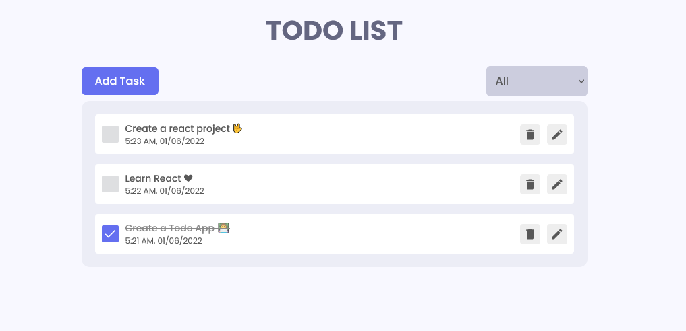

# React Todo App.

Steps to run this project 

Step1: Create a EC2 Instance 
step2: Install Docker and jenkins 
       $ sudo apt install docker.io
       $ curl -fsSL https://pkg.jenkins.io/debian/jenkins.io-2023.key | sudo tee \
        /usr/share/keyrings/jenkins-keyring.asc > /dev/null
       $ echo deb [signed-by=/usr/share/keyrings/jenkins-keyring.asc] \
         https://pkg.jenkins.io/debian binary/ | sudo tee \
         /etc/apt/sources.list.d/jenkins.list > /dev/null
       $ sudo apt-get update
       $ sudo apt-get install jenkins

step3: open jenkins webui 
step4: build a new pipeline from github 
step5: check the deployment 

